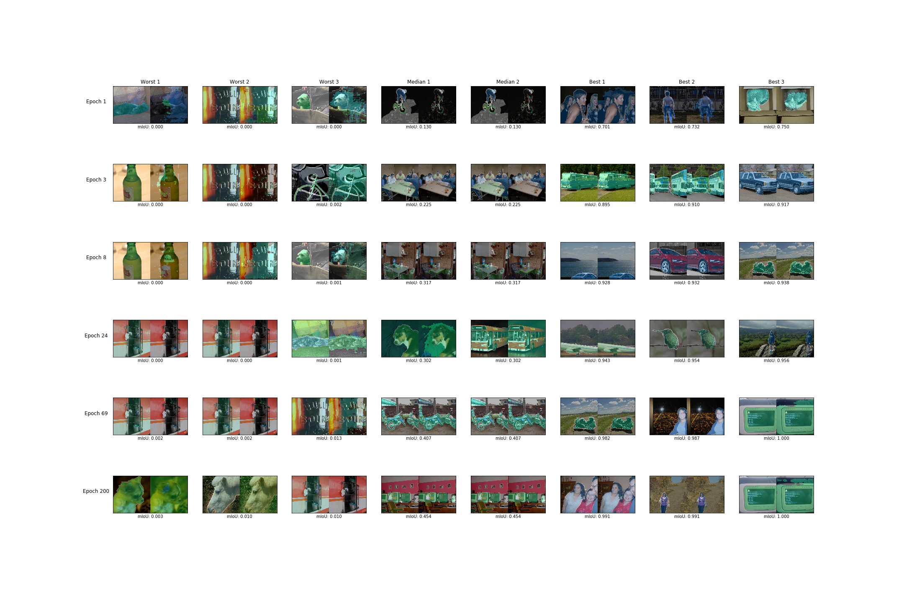
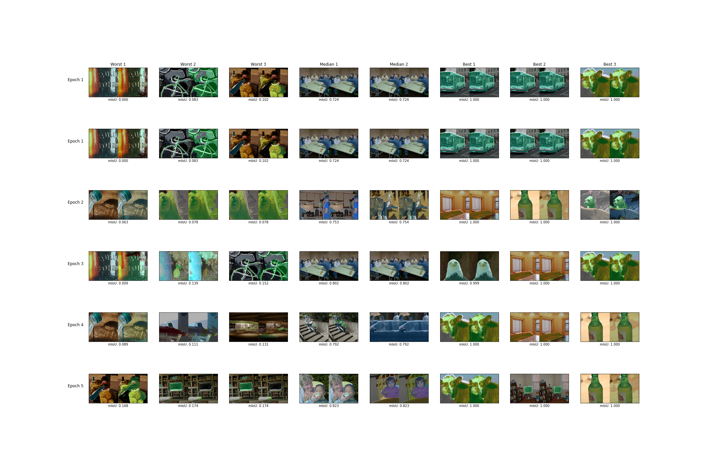
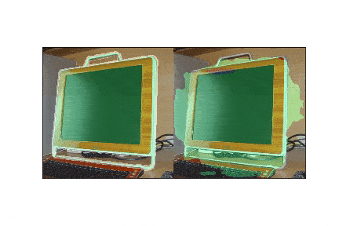

# DeepLab v3+ with Channel Attention and SpatialDropout, DropBlock and UOut
This repository is a reimplementation of https://github.com/jfzhang95/pytorch-deeplab-xception with two key changes - Channel Attention and Channel Dropout.

(By @smspillaz and @PaavoLeonhard).

We noticed that the original DeepLabv3+ [paper](https://arxiv.org/abs/1802.02611) made no mention of regularization techniques. We suspect that due to the large number of channels that are present in the model, it is possible that the network could over-weighting certain channels on the training set, meaning that the validation and test set performance could be lower. We therefore suggest two regularization mechanisms, Channel Attention and Channel Dropout to ameliorate this effect. We find that where overfitting is forced by training with a small training set that appropriate dropout and attention has a substantial regularizing effect.

# Model Architecture

# Performance
## VOC2012, full dataset

| Experiment | Train Loss | Train mIoU | Val Loss | Val mIoU |
|------------|------------|------------|----------|----------|
|Baseline    | 0.01       | 0.88       |0.03      | 0.76     |
|ResNet Dropout2D    | 0.02       | 0.65       |0.03      | 0.69     |
|Pyramid Pooling Dropout2D    | 0.01       | 0.88       |0.03      | 0.75     |
|Decoder Dropout2D    | 0.01       | 0.88       |0.03      | 0.76     |
|Decoder ChannelAttention    | 0.01       | 0.81       |0.03      | 0.75     |
|All    | 0.03       | 0.64       |0.04      | 0.67     |

## VOC2012, 10 train images

  |Experiment            | Mean mIoU|    Std.|    Worst mIoU|   Med. mIoU|   Best mIoU|    Loss|
  |--------------------- |-----------| --------| ------------| -----------| -----------| --------|
  |`pretrained-base`     |   0.81    |   0.09  |     0.55    |    0.82    |    0.99    |   0.02   |
  |`none`                |   0.49    |   0.10  |     0.26    |    0.50    |    0.65    |   0.06   |
  |`resnet-chandrop`     |  *0.56*   |  *0.09* |    *0.35*   |    0.50    |   *0.77*   |  *0.05*   |
  |`spp-chandrop`        |   0.54    |   0.10  |     0.28    |    0.53    |    0.74    |   0.06   |
  |`decoder-chandrop`    |   0.50    |  *0.09* |     0.32    |    0.53    |    0.67    |   0.06   |
  |`upper-chandrop`      |   0.49    |  *0.09* |     0.28    |    0.50    |    0.68    |   0.07   |
  |`all-chandrop`        |   0.55    |   0.11  |     0.27    |    0.55    |    0.76    |   0.06   |
  |`resnet-dropblock`    |   0.45    |   0.10  |     0.21    |    0.45    |    0.74    |   0.08   |
  |`spp-dropblock`       |   0.47    |  *0.09* |     0.29    |    0.46    |    0.72    |   0.06   |
  |`decoder-dropblock`   |   0.51    |  *0.09* |     0.34    |    0.50    |    0.68    |   0.07   |
  |`upper-dropblock`     |   0.51    |   0.10  |     0.30    |    0.51    |   *0.77*   |   0.07   |
  |`all-dropblock`       |   0.48    |   0.10  |     0.28    |    0.47    |    0.69    |   0.07   |
  |`resnet-uout`         |   0.50    |   0.11  |     0.31    |    0.49    |    0.74    |   0.06   |
  |`spp-uout`            |   0.50    |   0.11  |     0.29    |    0.50    |    0.74    |   0.06   |
  |`decoder-uout`        |   0.48    |   0.10  |     0.31    |    0.45    |    0.72    |   0.07   |
  |`upper-uout`          |  *0.56*   |  *0.09* |     0.31    |   *0.57*   |    0.72    |  *0.05*   |
  |`all-uout`            |   0.52    |   0.10  |     0.31    |    0.51    |    0.76    |   0.06   |

(Best results in each category italicized).

### Sample images

#### Baseline

#### Pyramid Channel Dropout

#### Pretrained model after fine-tuning on sample images

#### Fitting over time (DropBlock)

## Training

To train the network, first get the VOC2012 [devkit](http://host.robots.ox.ac.uk/pascal/VOC/voc2012/VOCdevkit_18-May-2011.tar) and [training/validation data](http://host.robots.ox.ac.uk/pascal/VOC/voc2012/VOCtrainval_11-May-2012.tar) and untar it to `data`. You can then use `segmentation_with_channel_regularization/train_voc.sh` and set `EXPERIMENT` in the environment to ensure that results end up in `experiments/$EXPERIMENT`. Additional arguments for the `segmentation_with_channel_regularization/train_spectral_dropout.py` file can be passed directly to `train_voc.sh`. All the paths have been wired up to assume that the data is in `segmentation_with_channel_regularization/../data`, but you can change it using the `--source-images`, `--segmentation-images`, `--training-set` and `--validation-set` options.

In order to limit the size of the training/validation data, just edit `data/VOCdevkit/VOC2012/ImageSets/train.txt` and delete lines referring to images that you want to exclude from the training set.

These arguments have the following effects:
 - `--decoder-dropout-rate`: Use specified dropout type in the decoder with given rate.
 - `--decoder-use-channel-attention`: Use ChannelAttention layer in the decoder
 - `--pyramid-dropout-rate`: Use specified dropout type in the pyramid pooling layers.
 - `--feature-detection-dropout-rate`: Use specified dropout type in the feature detection layers (default=0.0)
 - `--drop-type=(channel|patch|channel-uout)`: Which type of dropout to use
   - `channel`: Use SpatialDropout (Tompson, Goroshin, Jain, LeCun and Bregler) to drop entire channels.
   - `patch`: Use DropBlock (Ghiasi, Lin, Quoc V. Le) to drop patches of activations.
   - `channel-uout`: Use Channel UOut (Li, Chen, Hu, Yang), injects uniform noise into different channels, which does not introduce variance shift.
 - `--full-dropout-epoch`: Number of epochs until dropout is most effective (linear ramp). Default is 0, meaning that droput is always "on".
 - `--limit-train-data`: Percentage of training data to use.
 - `--classes-list`: Path to list of images and dominant classes in VOC2012 data. If specified, classes training data limitation will be stratified according to these classes, meaning that the classes are balanced.
